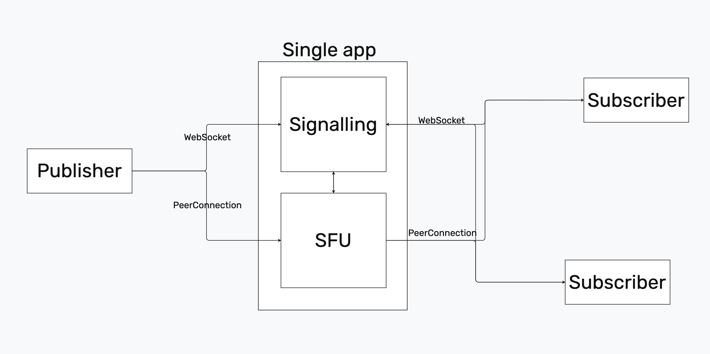

# WebRTC-grabber

---

The main use case is streaming live screen video from contestants' screens on
[ICPC World Finals](https://icpc.global/) as a part of
[ICPC Live](https://live.icpc.global/) broadcast.

**Table of Contents**

1. [WebRTC Protocol](#WebRTC-Protocol)
2. [Grabber](#Grabber)
   - [Configuration](#grabber-config)
   - [Build sources](#grabber-build)
   - [Run](#grabber-run)
3. [Signaling](#Signaling)
   - [Configuration](#signaling-config)
   - [Build sources](#signaling-build)
   - [Run](#signaling-run)
4. [SFU](#sfu)
   - [Config](#sfu-config)
   - [Run](#sfu-run)
   - [SFU Architecture](#sfu-architecture)
5. [TURN](#TURN)
   - [Using Docker](#turn-docker)
   - [Build sources](#turn-build)
   - [Run](#turn-run)
6. [FAQ](#FAQ)
7. [License](#License)

## WebRTC Protocol

---

[WebRTC](https://webrtc.org/) is a new protocol widely used for video
calling and screen sharing. It works over a local network, allows to start
the stream on-demand within roughly 1 sec and can be distributed portably.
There are multiple public implementations of WebRTC protocols, including
electron applications that we use as a reference point in this project.


WebRTC works by connecting each peer with each other to achieve peer to
peer communication.

In the environment of an ICPC competition, it’s hard to allow communication
between a computer inside the “blue” network and “red” network. WebRTC
needs ranges of UDP and TCP ports in order to send video. Opening all of
them to any device in the “red” network didn’t seem plausible. So we
decided upon using a **TURN** server on the edge of two networks to allow for
communication between those networks.
TURN is a server that provides service of connecting computers behind
multiple **NAT**-s.

It is able to do so because it has a constant globally available IP address
and anybody can connect to it using any TCP/UDP port. Then, after both
parties established a connection to it, the server passes all the data
between the peers.
We decided upon using it because it seemed like it’s the easiest way to
connect peers from the “blue” network with computers from the “red” network.

The solution consisted of 3 main parts:

- **Grabber** - standalone application for background capturing and sharing
  screen and webcam.
- **Signaling** - webserver to exchange connection data between the grabber
  and players, capture video in browser and maintain a list of active grabbers.
- **TURN** - server for forwarding video packages between grabber and
  players when they separated using NAT.

## Grabber

---

Grabber is an electron application that is running in the background and listens
for incoming calls from signaling.

### Configuration <a name="grabber-config"></a>

Grabber [`config.json`](packages/grabber/config.json):

```json
{
  "webcamConstraint": {
    "aspectRatio": 1.7777777778
  },
  "webcamAudioConstraint": true,
  "desktopConstraint": {
    "width": 1280,
    "height": 720
  }
}
```

where

| Property                | Description                                       | Type        |
| ----------------------- | ------------------------------------------------- | ----------- |
| `webcamConstraint`      | Webcam constraints                                | **object**  |
| `aspectRatio`           | Source aspect ratio                               | **number**  |
| `webcamAudioConstraint` | Sets the constraints on contestant's webcam audio | **boolean** |
| `desktopConstraint`     | Constraints on screen sharing                     | **object**  |
| `width`                 | Width of the sharing screen                       | **number**  |
| `height`                | Height of the sharing screen                      | **number**  |

### Build sources <a name="grabber-build"></a>

Clone the repository and run the following commands from the project root:

#### Windows

```powershell
$ grabber_build_win64.bat
```

#### Linux & MacOS

```shell
$ sh grabber_build.sh <platform> <arch>
```

where

- `<platform>` can be one of `linux`, `win32`, `macos`;
- `<arch>` can be `x64` or `arm64`.

### Run <a name="grabber-run"></a>

On the contestants' PC you need to extract files from the
`webrtc_grabber_grabber_<platform>_<arch>.zip` archive, which you can find on
the [Release page](https://github.com/irdkwmnsb/webrtc-grabber/releases/latest).

After that, you can run the grabber using executable:

#### Windows

- Launch in background (see
  [`runner.bat`](packages/grabber/scripts/runner.bat)):

  ```
  $ ~dp0grabber.exe . --peerName={number of computer} --signalingUrl="{signalling url}"
  ```

- For testing use the
  script [`tester.bat`](packages/grabber/scripts/tester.bat):

  ```
  $ ~dp0grabber.exe . --debugMode --peerName={number of computer}
  --signalingUrl="{signalling url}"
  ```

- Stop the grabber with
  the [`stopper.bat`](packages/grabber/scripts/stopper.bat)
  script.

#### Linux

Use [`grabber-linux.sh`](packages/grabber/scripts/grabber-linux.sh) script:

- Launch in background:

  ```shell
  $ bash grabber-linux.sh run {computer number} {signalling url}
  ```

- For testing use

  ```shell
  $ bash grabber-linux.sh test {computer number} {signalling url}
  ```

- Stop the grabber with
  ```shell
  $ bash grabber-linux.sh stop {computer number} {signalling url}
  ```

#### MacOS

The same as for Linux, but name of the script is
[`grabber-darwin.sh`](packages/grabber/scripts/grabber-darwin.sh).

## Signaling

---

Signaling part of the suite is a statefull express http server with two
socket.io endpoints. One for connecting the peers - `/peer`, and another to
connect the viewers - `/admin`.
The admin endpoint can be protected with a token that is specified in the config
file. Signaling is also responsible in providing the peers with the peer config
which contains the ICE servers to establish a connection between the peers.
The peer endpoint is used to talk to the team computers.
A peerConfig is sent to the grabber upon initial connection.
The admin endpoint is used to see all available peers and initiate the
connection to the peers.

### Configuration <a name="signaling-config"></a>

Signaling [`config.json`](packages/relay/conf/config.json):

```json
{
  "participants": ["001", "002", "003", "004", "005", "006", "007", "008"],
  "peerConnectionConfig": {
    "iceServers": [
      {
        "urls": "turn:193.233.204.163:3478",
        "username": "admin",
        "credential": "credential"
      }
    ]
  },
  "grabberPingInterval": 3000,
  "adminCredential": "live"
}
```

where

| Property               | Description                     | Type             |
| ---------------------- | ------------------------------- | ---------------- |
| `participants`         | Participant names               | **string array** |
| `peerConnectionConfig` | Connection config               | **object**       |
| `iceServers`           | Turn servers                    | **object array** |
| `urls`                 | Turn server URL                 | **string**       |
| `username`             | Turn server username            | **string**       |
| `credential`           | Turn server password            | **string**       |
| `grabberPingInterval`  | Ping to grabber in milliseconds | **number**       |
| `adminCredential`      | Signaling server password       | **string**       |

### Build sources <a name="signaling-build"></a>

Clone the repository and run the following commands from the
`packages/relay/cmd/signaling`:

```shell
$ go mod tidy
$ go build
```

### Run <a name="signaling-run"></a>

Extract files from the
`webrtc_grabber_signaling_<platform>_<arch>.zip` archive, which you can find on
the [Release page](https://github.com/irdkwmnsb/webrtc-grabber/releases/latest).

After that, you can run the signaling using scripts:

#### Windows

```powershell
$ signalling.cmd
```

#### Linux & MacOS

```shell
$ sh signalling.sh
```

## SFU

---

The SFU (Selective Forwarding Unit) functionality is integrated into the signaling server to efficiently handle media streaming between grabbers and multiple viewers. The SFU implementation uses a multiplexer architecture with track broadcasters that receive media streams from grabbers and selectively forward them to connected viewers without transcoding.

The system consists of several key components:
- **PeerManager** (`peer_manager.go:26`): Manages WebRTC peer connections between grabbers and viewers
- **TrackBroadcaster** (`track_broadcaster.go:13`): Handles media track forwarding from publishers to subscribers
- **Server** (`server.go:19`): WebSocket server managing grabber and player connections
- **Storage** (`storage.go:10`): Thread-safe storage for peer information and participant management



### Configuration <a name="sfu-config"></a>

The SFU configuration is part of the signaling server configuration in [`config.json`](packages/relay/conf/config.json):

```json
{
  "participants": ["001", "002", "003", "004", "005", "006", "007", "008"],
  "peerConnectionConfig": {
    "iceServers": [
      {
        "urls": "turn:193.233.204.163:3478",
        "username": "admin",
        "credential": "credential"
      }
    ]
  },
  "grabberPingInterval": 3000,
  "adminCredential": "live",
  "serverPort": 8000,
  "adminsNetworks": ["127.0.0.1/32", "10.0.0.0/8"],
  "codecs": [
    {
      "type": "video",
      "params": {
        "mimeType": "video/VP8",
        "clockRate": 90000,
        "payloadType": 96,
        "channels": 0
      }
    }
  ],
  "webcamTrackCount": 2
}
```

where

| Property               | Description                                    | Type             |
| ---------------------- | ---------------------------------------------- | ---------------- |
| `participants`         | List of expected participant names             | **string array** |
| `peerConnectionConfig` | WebRTC peer connection configuration           | **object**       |
| `iceServers`           | TURN/STUN servers for WebRTC connectivity     | **object array** |
| `grabberPingInterval`  | Ping interval from grabbers (milliseconds)    | **number**       |
| `adminCredential`      | Authentication credential for admin access     | **string**       |
| `serverPort`           | Server port (default: 8000)                   | **number**       |
| `adminsNetworks`       | Allowed IP networks for admin panel access    | **string array** |
| `codecs`               | Supported video/audio codecs                   | **object array** |
| `webcamTrackCount`     | Expected track count for webcam streams       | **number**       |

### Run <a name="sfu-run"></a>

The SFU functionality is built into the signaling server. Extract files from the `webrtc_grabber_signaling_<platform>_<arch>.zip` archive from the [Release page](https://github.com/irdkwmnsb/webrtc-grabber/releases/latest).

Run the signaling server with integrated SFU:

#### Windows

```powershell
$ signalling.cmd
```

#### Linux & MacOS

```shell
$ sh signalling.sh
```

### SFU Architecture <a name="sfu-architecture"></a>

The SFU implementation provides several key features:

1. **Media Multiplexing**: The `PeerManager` (`peer_manager.go:185`) handles multiple subscribers per publisher, creating WebRTC peer connections for each viewer requesting a stream.

2. **Track Broadcasting**: Each media track from grabbers is managed by a `TrackBroadcaster` (`track_broadcaster.go:21`) that:
   - Receives RTP packets from the remote track
   - Broadcasts them to all subscribed viewers using concurrent goroutines
   - Automatically removes disconnected subscribers

3. **Stream Type Support**: The system supports multiple stream types per grabber:
   - `webcam`: Video and audio from participant's webcam
   - `desktop`: Screen sharing from participant's desktop

4. **Connection Management**:
   - Automatic cleanup of disconnected peers (`peer_manager.go:103`)
   - ICE candidate handling for NAT traversal
   - Timeout handling for publisher setup (20 second timeout)

5. **Scalability Features**:
   - Concurrent packet writing with semaphore-based throttling
   - Efficient memory management with GC tuning
   - Thread-safe storage using custom `SyncMapWrapper` (`sync_map.go:5`)

The SFU eliminates the need for separate media server deployment while providing efficient one-to-many streaming capabilities directly within the signaling infrastructure.

## TURN

---

Turn server is used to transmit video/audio data across different networks.
We provide a lightweight Go-based TURN server implementation that can be run either
as a standalone binary or using Docker.

> [!WARNING]
> TURN servers are typically unnecessary when using an SFU architecture

### Build sources <a name="turn-build"></a>

Clone the repository and run the following commands from the
`packages/go-turn`:

```shell
$ go mod tidy
$ go build
```

### Run <a name="turn-run"></a>

Extract files from the
`webrtc_grabber_turn_<platform>_<arch>.zip` archive, which you can find on
the [Release page](https://github.com/irdkwmnsb/webrtc-grabber/releases/latest).

After that, you can run the signaling using scripts:

#### Windows

```powershell
$ turn.cmd
```

#### Linux & MacOS

```shell
$ sh turn.sh
```

## FAQ

---

**General**

> **Q:** Is it true that VLC is no longer needed on the participants' computers?
> <br> > **A:** **Yes**.

> **Q:** Is it true that when `webrtc-grabber` starts, it starts uploading the
> image to the network without any additional requests?
> <br> > **A:** **No**. It starts pinging the server with an interval of 3
> seconds (can be configured in
> signaling [`config.json`](packages/relay/conf/config.json),
> `grabberPingInterval` parameter) and gives the stream only if it receives a
> request.

> **Q:** Is it true that during the update it will be necessary to
> completely re-upload `grabber` executable (~100MB)?
> <br> > **A:** **Yes**.

> **Q:** How to test the performance of `webrtc-grabber` without access to
> the Internet, on Ubuntu, Windows?
> <br> > **A:** It is necessary to raise the signaling. This is
> a [Go server](https://github.com/irdkwmnsb/webrtc-grabber/tree/main/packages/relay/signaling).
> See instructions above: [How to run signaling](#signaling-run).
> If the computers on the local network have direct access to each other
> (without intermediate **NAT**), then the turn server is not needed.

> **Q:** How to check if the signaling service is up and running?
> <br> > **A:** If you run signaling service, you will be able to see the interface
> on `localhost:8000`.

**Connections and TURN-relay**

> **Q:** How many (TCP/UDP) ports do you really need? Does their number
> depend on the number of streams and how?
> <br> > **A:** The number of ports depends on the number of simultaneous connections.

> **Q:** Is it true that clients only differ in `peerName` in `config.json`,
> and technically they all use the same port in `signalingUrl`?
> <br> > **A:** **Yes**. All grabbers use the same `signalingUrl` port. In fact, the
> unique identifier of the grabber is the id of the socket with it.
> `peerName` is an acquisition above it, that is, the relationship between
> `peerId` and `peerName` occurs after the connection.

> **Q:** What width of the channel is needed to the client?
> <br> > **A:** It is claimed that one connection needs 2-3 Mbps.

> **Q:** What delays are acceptable for normal operation \[1-100-10000ms\]?
> <br> > **A:** We use SRTP connection for video, `http/websocket` connection for
> signaling. So packet loss is allowed at all levels. The way
> the peers can tell if they are connected or not depending on the latency
> is controlled by the underlying WebRTC implementation of Chromium and
> the browser on the viewer side.
>
> We didn't do any testing with adding latency to the connection, but we know
> that grabber successfully connects and shows a reliable stream over the internet
> using wifi.
> That proves that it can be used in local networks even over wifi.
>
> Another relevant question to ask is how _reliable_ the connection must be.
> And this question is perfectly answered by the ability to have video calls
> in Telegram / VK / Discord / Google meet from the subway. The
> connection will try to recover under the same conditions until we break
> it by force.

> **Q:** Have you tested compatibility with OpenVPN?
> <br> > **A:** We tried streaming over VPN, it worked.

> **Q:** Is it true that the Turn-relay should be at the edge of the network
> of participants, and the signaling server is in Live?
> <br> > **A:** There should be access to the turn service from the contestants network, and
> from the live network. Theoretically, turn may not necessarily be on the
> border if all the required packets of the WebRTC protocol are properly proxied/redirected.

> **Q:** How many, what (TCP/UDP) and in what direction (from or to the
> contestants) packets with which ports do we need to allow through the firewall and is it true that in this case we can do
> without installing Turn-relay?
> Or in other words: how to make it work without the turn service and what
> changes must be made to the firewall for that to happen?
> <br> > **A:** You can see the screens without a turn-relay if the computers of the
> contestants, the signaling server and the viewer computer are reachable from
> the same network. It's easy to see that this doesn't fit the conditions of
> the competition, because of the way the network is usually set up.
> It's easier to assume that WebRTC uses an arbitrary UDP port when the two peers connect.
>
> If we use Turn-relay, we need to allow traffic from the participants network to
> TCP port 3000 (signaling), port 3478 (TCP and UDP) and a certain range of
> UDP ports (As experiments have shown, one active connection consumes 2
> ports. Probably, 200 ports will be enough with more The numbers can be
> anything, for example 40000-40199).

> **Q:** Which Turn-relay can be used under Windows (highly desirable
> without Cygwin)?
> <br> > **A:** You can use our Turn-relay. See [Turn](#TURN).

## License

---

This project is licensed under
the [MIT license](https://en.wikipedia.org/wiki/MIT_License). You can freely use
our tools in your commercial or opensource software.
