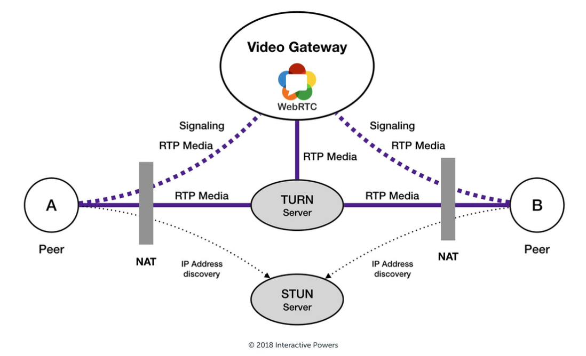

# WebRTC-grabber
---

The main use case is streaming live screen video from contestants' screens on
[ICPC World Finals](https://icpc.global/) as a part of
[ICPC Live](https://live.icpc.global/) broadcast.

**Table of Contents**

1. [WebRTC Protocol](#WebRTC-Protocol)
2. [Grabber](#Grabber)
    - [Configuration](#grabber-config)
    - [Build sources](#grabber-build)
    - [Run](#grabber-run)
        - [Docker](#grabber-docker)
        - [Executable (Windows, Linux, MacOS)](#grabber-exec)
3. [Signaling](#Signaling)
    - [Configuration](#signaling-config)
    - [Build sources](#signaling-build)
    - [Run](#signaling-run)
        - [Docker](#signaling-docker)
        - [Executable (Windows, Linux, MacOS)](#signaling-exec)
4. [TURN](#TURN)
5. [FAQ](#FAQ)
6. [License](#License)

## WebRTC Protocol
---

[WebRTC](https://webrtc.org/) is a new protocol widely used for video
calling and screen sharing. It works over a local network, allows to start
the stream on-demand within roughly 1 sec and can be distributed portably.
There are multiple public implementations of WebRTC protocols, including
electron applications that we use as a reference point in this project.


WebRTC works by connecting each peer with each other to achieve peer to
peer communication.
In our example, peer A would be the team computer, and peer B would be our
computer for live-streaming (since it’s the one that’s actually showing the
feed).



In the environment of an ICPC competition, it’s hard to allow communication
between a computer inside the “blue” network and “red” network. WebRTC
needs ranges of UDP and TCP ports in order to send video. Opening all of
them to any device in the “red” network didn’t seem plausible. So we
decided upon using a **TURN** server on the edge of two networks to allow for
communication between those networks.
TURN is a server that provides service of connecting computers behind
multiple **NAT**-s.

It is able to do so because it has a constant globally available IP address
and anybody can connect to it using any TCP/UDP port. Then, after both
parties established a connection to it, the server passes all the data
between the peers.
We decided upon using it because it seemed like it’s the easiest way to
connect peers from the “blue” network with computers from the “red” network.

The solution consisted of 3 main parts:

- **Grabber**
- **Signaling**
- **TURN**

## Grabber
---

Grabber is an electron application that is running in the background and listens
for incoming calls from signaling.

### Configuration <a name="grabber-config"></a>

Grabber [`config.json`](packages/grabber/config.json):

```json
{
  "webcamConstraint": {
    "aspectRatio": 1.7777777778
  },
  "webcamAudioConstraint": true,
  "desktopConstraint": {
    "width": 1280,
    "height": 720
  }
}
```

where

| Property                | Description                                       | Type        |
|-------------------------|---------------------------------------------------|-------------|
| `webcamConstraint`      | Webcam constraints                                | **object**  |
| `aspectRatio`           | Source aspect ratio                               | **number**  |
| `webcamAudioConstraint` | Sets the constraints on contestant's webcam audio | **boolean** |
| `desktopConstraint`     | Constraints on screen sharing                     | **object**  |
| `width`                 | Width of the sharing screen                       | **number**  |
| `height`                | Height of the sharing screen                      | **number**  |

### Build sources <a name="grabber-build"></a>

Clone the repository and run the following commands from the project root:

#### Windows

```powershell
% grabber_build_win64.bat
```

#### Linux & MacOS

```shell
$ sh grabber_build.sh <platform> <arch>
```

where

- `<platform>` can be one of `linux`, `win32`, `macos`;
- `<arch>` can be `x64` or `arm64`.

### Run <a name="grabber-run"></a>

On the contestants' PC you need to extract files from the
`webrtc_grabber_grabber_<os>_<arch>.zip` archive, which you can find
on
the [Release page](https://github.com/irdkwmnsb/webrtc-grabber/releases/latest).

After that, you can run the grabber using docker or executable:

#### Docker <a name="grabber-docker"></a>

Run the following commands from the project root:

TODO: Edit commands.

```shell
$ docker build -t grabber .
$ docker run -d -p 3000:3000 --name grabber grabber
```

#### Executable <a name="grabber-exec"></a>

##### Windows

- Launch in background (
  see [`runner.bat`](packages/grabber/scripts/runner.bat)):
  ```
  % ~dp0grabber.exe . --peerName={number of computer} --signalingUrl="
  {signalling url}"
  ```

- For testing use the
  script [`tester.bat`](packages/grabber/scripts/tester.bat):
  ```
  % ~dp0grabber.exe . --debugMode --peerName={number of computer} 
  --signalingUrl="{signalling url}"
  ```

- Stop the grabber with
  the [`stopper.bat`](packages/grabber/scripts/stopper.bat)
  script.

##### Linux

Use [`grabber-linux.sh`](packages/grabber/scripts/grabber-linux.sh) script:

- Launch in background:
  ```shell
  $ bash grabber-linux.sh run {computer number} {signalling url}
  ```

- For testing use
  ```shell
  $ bash grabber-linux.sh test {computer number} {signalling url}
  ```

- Stop the grabber with
  ```shell
  $ bash grabber-linux.sh stop {computer number} {signalling url}
  ```

##### MacOS

The same as for Linux, but name of the script is
[`grabber-darwin.sh`](packages/grabber/scripts/grabber-darwin.sh).

## Signaling
---

Signaling part of the suite is a statefull express http server with two
socket.io endpoints. One for connecting the peers - `/peer`, and another to
connect the viewers - `/admin`.
The admin endpoint can be protected with a token that is specified in the config
file. Signaling is also responsible in providing the peers with the peer config
which contains the ICE servers to establish a connection between the peers.
The peer endpoint is used to talk to the team computers.
A peerConfig is sent to the grabber upon initial connection.
The admin endpoint is used to see all available peers and initiate the
connection to the peers.

### Configuration <a name="signaling-config"></a>

Signaling [`config.json`](packages/relay/conf/config.json):

```json
{
  "participants": [
    "001",
    "002",
    "003",
    "004",
    "005",
    "006",
    "007",
    "008"
  ],
  "peerConnectionConfig": {
    "iceServers": [
      {
        "urls": "turn:193.233.204.163:3478",
        "username": "admin",
        "credential": "credential"
      }
    ]
  },
  "grabberPingInterval": 3000,
  "adminCredential": "live"
}
```

where

| Property               | Description                     | Type             |
|------------------------|---------------------------------|------------------|
| `participants`         | Participant names               | **string array** |
| `peerConnectionConfig` | Connection config               | **object**       |
| `iceServers`           | Turn servers                    | **object array** |
| `urls`                 | Turn server URL                 | **string**       |
| `username`             | Turn server username            | **string**       |
| `credential`           | Turn server password            | **string**       |
| `grabberPingInterval`  | Ping to grabber in milliseconds | **number**       |
| `adminCredential`      | Signaling server password       | **string**       |

### Build sources <a name="signaling-build"></a>

Clone the repository and run the following commands from the
`packages/relay/cmd/signaling`:

```shell
$ go mod tidy
$ go build
```

### Run <a name="signaling-run"></a>

#### Docker <a name="signaling-docker"></a>

TODO

#### Executable <a name="signaling-exec"></a>

TODO

## TURN
---

Turn server is used to transmit video/audio data across different networks.
We use an open source implementation of turn
called [coturn](https://github.com/coturn/coturn) inside docker with
host network type.

## FAQ
---

TODO

## License
---

This project is licensed under
the [MIT license](https://en.wikipedia.org/wiki/MIT_License). You can freely use
our tools in your commercial or opensource software.
